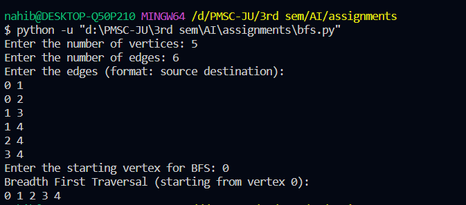
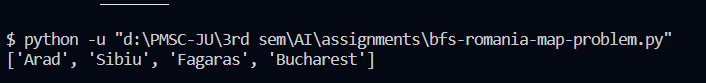
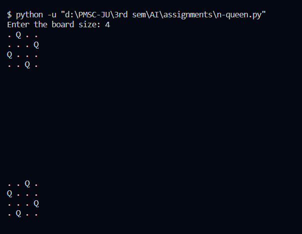

# BFS

BFS stands for Breadth-First Search. It's a graph traversal algorithm that explores a graph or tree level by level, starting from the root or an arbitrary node. It uses a queue to visit nodes at the current depth before moving on to the next depth. BFS is often used to find the shortest path in unweighted graphs.

## Code

```python

from collections import defaultdict, deque

class BFS:
    def __init__(self, vertices):
        self.vertices = vertices
        self.adjacency_list = defaultdict(list)

    def add_edge(self, v, w):
        self.adjacency_list[v].append(w)

    def bfs(self, start_vertex):
        visited = [False] * self.vertices
        queue = deque()

        visited[start_vertex] = True
        queue.append(start_vertex)

        while queue:
            current_vertex = queue.popleft()
            print(current_vertex, end=" ")

            for neighbor in self.adjacency_list[current_vertex]:
                if not visited[neighbor]:
                    visited[neighbor] = True
                    queue.append(neighbor)

if __name__ == "__main__":
    try:
        vertices = int(input("Enter the number of vertices: "))
    except ValueError:
        print("Invalid input. Please enter a valid integer for the number of vertices.")
        exit()

    g = BFS(vertices)

    try:
        edges = int(input("Enter the number of edges: "))
    except ValueError:
        print("Invalid input. Please enter a valid integer for the number of edges.")
        exit()

    print("Enter the edges (format: source destination): ")
    for _ in range(edges):
        try:
            source, destination = map(int, input().split())
        except ValueError:
            print("Invalid input. Please enter valid integers for the edges.")
            exit()

        g.add_edge(source, destination)

    try:
        start_vertex = int(input("Enter the starting vertex for BFS: "))
    except ValueError:
        print("Invalid input. Please enter a valid integer for the starting vertex.")
        exit()

    print("Breadth First Traversal (starting from vertex {}):".format(start_vertex))
    g.bfs(start_vertex)


```

## BFS Output



# BFS Romania-Map Problem


## Code

```python

from queue import Queue

romaniaMap = {
    'Arad': ['Sibiu', 'Zerind', 'Timisoara'],
    'Zerind': ['Arad', 'Oradea'],
    'Oradea': ['Zerind', 'Sibiu'],
    'Sibiu': ['Arad', 'Oradea', 'Fagaras', 'Rimnicu'],
    'Timisoara': ['Arad', 'Lugoj'],
    'Lugoj': ['Timisoara', 'Mehadia'],
    'Mehadia': ['Lugoj', 'Drobeta'],
    'Drobeta': ['Mehadia', 'Craiova'],
    'Craiova': ['Drobeta', 'Rimnicu', 'Pitesti'],
    'Rimnicu': ['Sibiu', 'Craiova', 'Pitesti'],
    'Fagaras': ['Sibiu', 'Bucharest'],
    'Pitesti': ['Rimnicu', 'Craiova', 'Bucharest'],
    'Bucharest': ['Fagaras', 'Pitesti', 'Giurgiu', 'Urziceni'],
    'Giurgiu': ['Bucharest'],
    'Urziceni': ['Bucharest', 'Vaslui', 'Hirsova'],
    'Hirsova': ['Urziceni', 'Eforie'],
    'Eforie': ['Hirsova'],
    'Vaslui': ['Iasi', 'Urziceni'],
    'Iasi': ['Vaslui', 'Neamt'],
    'Neamt': ['Iasi']
}


def bfs(startingNode, destinationNode):
    # For keeping track of what we have visited
    visited = {}
    # keep track of distance
    distance = {}
    # parent node of specific graph
    parent = {}

    bfs_traversal_output = []
    # BFS is queue based so using 'Queue' from python built-in
    queue = Queue()

    # travelling the cities in map
    for city in romaniaMap.keys():
        # since intially no city is visited so there will be nothing in visited list
        visited[city] = False
        parent[city] = None
        distance[city] = -1

    # starting from 'Arad'
    startingCity = startingNode
    visited[startingCity] = True
    distance[startingCity] = 0
    queue.put(startingCity)

    while not queue.empty():
        u = queue.get()     # first element of the queue, here it will be 'arad'
        bfs_traversal_output.append(u)

        # explore the adjust cities adj to 'arad'
        for v in romaniaMap[u]:
            if not visited[v]:
                visited[v] = True
                parent[v] = u
                distance[v] = distance[u] + 1
                queue.put(v)

        # reaching our destination city i.e 'bucharest'
    g = destinationNode
    path = []
    while g is not None:
        path.append(g)
        g = parent[g]

    path.reverse()
    # printing the path to our destination city
    print(path)


# Starting City & Destination City
bfs('Arad', 'Bucharest')


```

## output



# N-Queen

## Code

```python

def solve_n_queens(n):
    queens = [-1] * n
    result = []
    place_queens(queens, 0, n, result)
    return result

def place_queens(queens, row, n, result):
    if row == n:
        result.append(queens[:])
        return

    for col in range(n):
        if is_safe(queens, row, col):
            queens[row] = col
            place_queens(queens, row + 1, n, result)

def is_safe(queens, row, col):
    for i in range(row):
        if queens[i] == col or queens[i] - i == col - row or queens[i] + i == col + row:
            return False
    return True

def print_board(queens):
    for row in range(len(queens)):
        line = ""
        for col in range(len(queens)):
            if queens[row] == col:
                line += "Q "
            else:
                line += ". "
        print(line)
    print()

if __name__ == "__main__":
    n = int(input("Enter the board size: "))
    solutions = solve_n_queens(n)

    for solution in solutions:
        print_board(solution)


```

## Output



# Breadth-First Search (BFS) VS Depth-First Search (DFS):

| Aspect                            | Breadth-First Search (BFS)                                                           | Depth-First Search (DFS)                                                             |
| --------------------------------- | ------------------------------------------------------------------------------------ | ------------------------------------------------------------------------------------ |
| **Traversal Order**               | Level by level.                                                                      | Depth-first: explores as far as possible along each branch before backtracking.      |
| **Data Structure**                | Uses a queue.                                                                        | Uses a stack (or recursion in the case of recursive DFS).                            |
| **Memory Usage**                  | Tends to require more memory as it stores all nodes at the current level.            | Memory usage is generally lower as it only needs to store a single path at a time.   |
| **Completeness**                  | Guarantees finding the shortest path in unweighted graphs.                           | Does not guarantee finding the shortest path.                                        |
| **Applications**                  | Shortest path problems, network routing, puzzle solving.                             | Topological sorting, maze solving, cycle detection.                                  |
| **Time Complexity (Worst Case)**  | \(O(V + E)\) where \(V\) is the number of vertices and \(E\) is the number of edges. | \(O(V + E)\) where \(V\) is the number of vertices and \(E\) is the number of edges. |
| **Space Complexity (Worst Case)** | \(O(V)\) where \(V\) is the number of vertices.                                      | \(O(V)\) where \(V\) is the number of vertices.                                      |
| **Implementation**                | Typically implemented iteratively.                                                   | Can be implemented using recursion or a stack.                                       |
| **Use Cases**                     | Shortest path problems, connectivity analysis, level order traversal.                | Topological sorting, maze solving, connectivity analysis.                            |
| **Parallelization**               | Challenging to parallelize due to its sequential nature.                             | More amenable to parallelization, especially in the recursive form.                  |
